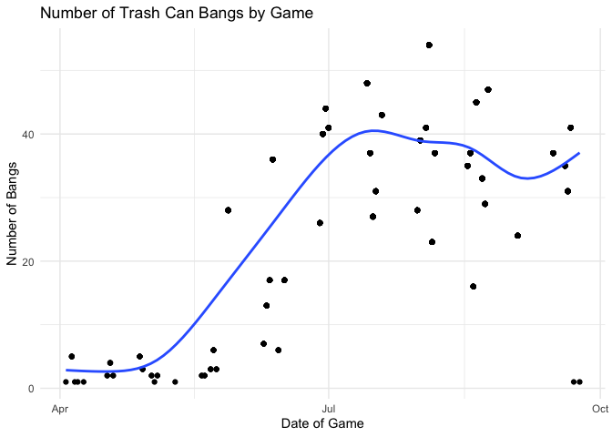
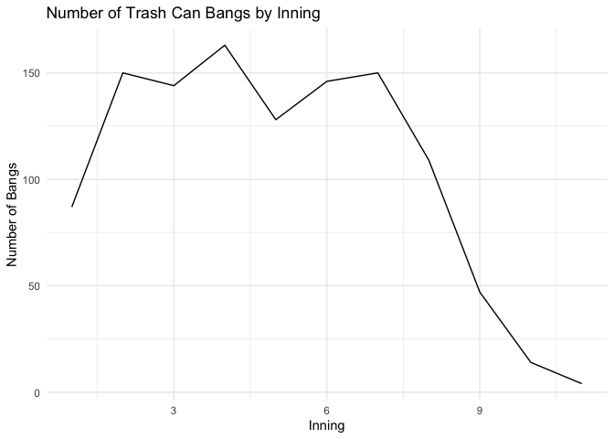

# AstrosCheating


The goal of AstrosCheating is to give insight into the Houston Astros
2017 cheating scandal by providing data and sample analysis regarding
the situtation.

## Installation

You can install the released version of AstrosCheating from
[CRAN](https://CRAN.R-project.org) with:

``` r
install.packages("AstrosCheating")
```

And the development version from [GitHub](https://github.com/) with:

``` r
# install.packages("devtools")
devtools::install_github("Tylermarshall21/AstrosCheating")
```

## Example Analysis

This is example analysis that can be done with this package.

``` r
library(AstrosCheating)
```

The first thing I would like to look into further is to see when the
cheating began for the Astros. By looking at the total number of bangs
by game, it should be clear when the Astros really started cheating.

``` r
#Find the number of bangs by game
date_bangs <- AstrosCheating %>%
  group_by(game_date) %>%
  filter(has_bangs == "y") %>%
  mutate(bangs = length(game_date)) %>%
  arrange(bangs)

#Plot the number of bangs by game
ggplot(data = date_bangs, aes(x = game_date, y = bangs)) +
  geom_point() +
  geom_smooth(se =  FALSE) + 
  theme_minimal() +
  labs(title = "Number of Trash Can Bangs by Game", x = "Date of Game",
       y = "Number of Bangs")
```



From this, we can see that the Astros did not start employing this
cheating strategy until the middle of the season. There were very few
bangs on the trash can during April’s home games, but it looks like the
cheating began at the end of May. On May 28th, 2017, the Astros had 28
bangs on the trash can which seemed to be the real start of their
cheating strategy. There is still some variation in the number of bangs
per game, but it becomes clear that the Astros were cheating for the
rest of the season. However, it is interesting that the Astros seemed to
quit cheating in the final two home games of the regular season. The
Astros had already clinched the division at this point, so that could
explain why they did not feel the need to cheat, but it is definitely
interesting that they stopped banging on trash cans in those last two
home games.

The next thing I would like to look into further is to see which hitters
were most involved in the cheating strategy. The Astros did not do this
all the time, and hitters were involved to a varying degree, so I’d like
to know more about who cheated most often.

``` r
#Find total number of bangs for each player
player_bangs <- AstrosCheating %>%
  group_by(batter) %>%
  filter(has_bangs == "y") %>%
  mutate(bangs = length(batter)) %>%
  select(batter, bangs) %>%
  distinct() %>%
  arrange(desc(bangs)) %>%
  rename(`Batter Name` = batter, `Pitches with Bangs` = bangs)
#Create table to display results
knitr::kable(player_bangs) %>%
  kable_styling(latex_options = c("striped", "HOLD_position"))
```

<table class="table" style="margin-left: auto; margin-right: auto;">

<thead>

<tr>

<th style="text-align:left;">

Batter Name

</th>

<th style="text-align:right;">

Pitches with Bangs

</th>

</tr>

</thead>

<tbody>

<tr>

<td style="text-align:left;">

Marwin Gonzalez

</td>

<td style="text-align:right;">

147

</td>

</tr>

<tr>

<td style="text-align:left;">

George Springer

</td>

<td style="text-align:right;">

139

</td>

</tr>

<tr>

<td style="text-align:left;">

Carlos Beltran

</td>

<td style="text-align:right;">

138

</td>

</tr>

<tr>

<td style="text-align:left;">

Alex Bregman

</td>

<td style="text-align:right;">

133

</td>

</tr>

<tr>

<td style="text-align:left;">

Yuli Gurriel

</td>

<td style="text-align:right;">

120

</td>

</tr>

<tr>

<td style="text-align:left;">

Carlos Correa

</td>

<td style="text-align:right;">

97

</td>

</tr>

<tr>

<td style="text-align:left;">

Jake Marisnick

</td>

<td style="text-align:right;">

83

</td>

</tr>

<tr>

<td style="text-align:left;">

Evan Gattis

</td>

<td style="text-align:right;">

71

</td>

</tr>

<tr>

<td style="text-align:left;">

Brian McCann

</td>

<td style="text-align:right;">

45

</td>

</tr>

<tr>

<td style="text-align:left;">

Josh Reddick

</td>

<td style="text-align:right;">

28

</td>

</tr>

<tr>

<td style="text-align:left;">

Tyler White

</td>

<td style="text-align:right;">

28

</td>

</tr>

<tr>

<td style="text-align:left;">

Jose Altuve

</td>

<td style="text-align:right;">

24

</td>

</tr>

<tr>

<td style="text-align:left;">

Norichika Aoki

</td>

<td style="text-align:right;">

16

</td>

</tr>

<tr>

<td style="text-align:left;">

Derek Fisher

</td>

<td style="text-align:right;">

16

</td>

</tr>

<tr>

<td style="text-align:left;">

J.D. Davis

</td>

<td style="text-align:right;">

14

</td>

</tr>

<tr>

<td style="text-align:left;">

Juan Centeno

</td>

<td style="text-align:right;">

13

</td>

</tr>

<tr>

<td style="text-align:left;">

Max Stassi

</td>

<td style="text-align:right;">

13

</td>

</tr>

<tr>

<td style="text-align:left;">

Cameron Maybin

</td>

<td style="text-align:right;">

13

</td>

</tr>

<tr>

<td style="text-align:left;">

AJ Reed

</td>

<td style="text-align:right;">

4

</td>

</tr>

</tbody>

</table>

From this table, we see that Marwin Gonzalez, George Springer, Carlos
Beltran, Alex Bregman, and Yuli Gurriel were most frequently the
beneficiaries of trash can bangs with all of them having at least 120
pitches where they received a trash can bang before the pitch. While
this shows the total number of pitches where a bang occurred, it is a
little misleading because hitters that see more pitches would be more
likely to have more bangs. I would also like to look at a percentage of
pitches where the hitters received a bang to see if the results are
similar.

``` r
#Find the percentage of bangs for each player
percentage_bangs <- AstrosCheating %>%
  group_by(batter) %>%
  mutate(total_pitches = length(batter)) %>%
  filter(has_bangs == "y") %>%
  mutate(total_bangs = length(batter),
         percent_bangs = round((total_bangs/total_pitches)*100,3)) %>%
  select(batter, total_bangs, total_pitches, percent_bangs) %>%
  arrange(desc(percent_bangs)) %>%
  distinct() %>%
  rename(`Batter Name` = batter, `Total Bangs` = total_bangs, 
         `Total Pitches` = total_pitches, 
         `Percentage of Pitches with Bangs` = percent_bangs)
#Create table to display results
knitr::kable(percentage_bangs) %>%
  kable_styling(latex_options = c("striped", "HOLD_position"))
```

<table class="table" style="margin-left: auto; margin-right: auto;">

<thead>

<tr>

<th style="text-align:left;">

Batter Name

</th>

<th style="text-align:right;">

Total Bangs

</th>

<th style="text-align:right;">

Total Pitches

</th>

<th style="text-align:right;">

Percentage of Pitches with Bangs

</th>

</tr>

</thead>

<tbody>

<tr>

<td style="text-align:left;">

J.D. Davis

</td>

<td style="text-align:right;">

14

</td>

<td style="text-align:right;">

49

</td>

<td style="text-align:right;">

28.571

</td>

</tr>

<tr>

<td style="text-align:left;">

Tyler White

</td>

<td style="text-align:right;">

28

</td>

<td style="text-align:right;">

106

</td>

<td style="text-align:right;">

26.415

</td>

</tr>

<tr>

<td style="text-align:left;">

Max Stassi

</td>

<td style="text-align:right;">

13

</td>

<td style="text-align:right;">

52

</td>

<td style="text-align:right;">

25.000

</td>

</tr>

<tr>

<td style="text-align:left;">

Cameron Maybin

</td>

<td style="text-align:right;">

13

</td>

<td style="text-align:right;">

56

</td>

<td style="text-align:right;">

23.214

</td>

</tr>

<tr>

<td style="text-align:left;">

Jake Marisnick

</td>

<td style="text-align:right;">

83

</td>

<td style="text-align:right;">

364

</td>

<td style="text-align:right;">

22.802

</td>

</tr>

<tr>

<td style="text-align:left;">

Juan Centeno

</td>

<td style="text-align:right;">

13

</td>

<td style="text-align:right;">

65

</td>

<td style="text-align:right;">

20.000

</td>

</tr>

<tr>

<td style="text-align:left;">

Marwin Gonzalez

</td>

<td style="text-align:right;">

147

</td>

<td style="text-align:right;">

776

</td>

<td style="text-align:right;">

18.943

</td>

</tr>

<tr>

<td style="text-align:left;">

Carlos Beltran

</td>

<td style="text-align:right;">

138

</td>

<td style="text-align:right;">

762

</td>

<td style="text-align:right;">

18.110

</td>

</tr>

<tr>

<td style="text-align:left;">

Yuli Gurriel

</td>

<td style="text-align:right;">

120

</td>

<td style="text-align:right;">

670

</td>

<td style="text-align:right;">

17.910

</td>

</tr>

<tr>

<td style="text-align:left;">

Evan Gattis

</td>

<td style="text-align:right;">

71

</td>

<td style="text-align:right;">

427

</td>

<td style="text-align:right;">

16.628

</td>

</tr>

<tr>

<td style="text-align:left;">

Alex Bregman

</td>

<td style="text-align:right;">

133

</td>

<td style="text-align:right;">

800

</td>

<td style="text-align:right;">

16.625

</td>

</tr>

<tr>

<td style="text-align:left;">

Carlos Correa

</td>

<td style="text-align:right;">

97

</td>

<td style="text-align:right;">

594

</td>

<td style="text-align:right;">

16.330

</td>

</tr>

<tr>

<td style="text-align:left;">

George Springer

</td>

<td style="text-align:right;">

139

</td>

<td style="text-align:right;">

933

</td>

<td style="text-align:right;">

14.898

</td>

</tr>

<tr>

<td style="text-align:left;">

AJ Reed

</td>

<td style="text-align:right;">

4

</td>

<td style="text-align:right;">

27

</td>

<td style="text-align:right;">

14.815

</td>

</tr>

<tr>

<td style="text-align:left;">

Brian McCann

</td>

<td style="text-align:right;">

45

</td>

<td style="text-align:right;">

507

</td>

<td style="text-align:right;">

8.876

</td>

</tr>

<tr>

<td style="text-align:left;">

Derek Fisher

</td>

<td style="text-align:right;">

16

</td>

<td style="text-align:right;">

211

</td>

<td style="text-align:right;">

7.583

</td>

</tr>

<tr>

<td style="text-align:left;">

Norichika Aoki

</td>

<td style="text-align:right;">

16

</td>

<td style="text-align:right;">

261

</td>

<td style="text-align:right;">

6.130

</td>

</tr>

<tr>

<td style="text-align:left;">

Josh Reddick

</td>

<td style="text-align:right;">

28

</td>

<td style="text-align:right;">

725

</td>

<td style="text-align:right;">

3.862

</td>

</tr>

<tr>

<td style="text-align:left;">

Jose Altuve

</td>

<td style="text-align:right;">

24

</td>

<td style="text-align:right;">

866

</td>

<td style="text-align:right;">

2.771

</td>

</tr>

</tbody>

</table>

When looking at percentage of pitches where the hitter received a bang,
there are some different names at the top of the list. J.D Davis, Tyler
White, and Max Stassi had the highest percentage of bangs when they were
hitting, but were not everyday players which is why they weren’t at the
top of the total bangs table created above. Also, none of these three
players were on the opening day roster for the Astros which could
explain why their percentages were higher than the typical starters.
Based on the analysis above, it seems the Astros did not start cheating
until May 28th, 2020 which could be part of the reason that the starters
have lower percentages compared to some of the backups that were not on
the roster to start the season. Another interesting observation from
this table is that Tony Kemp was the only player to not receive any
bangs which suggests he was not a part of the cheating scandal. Josh
Reddick and Jose Altuve who started almost every game for the Astros
very rarely received bangs either which indicates they were not very
involved in the scandal either.

The next part of the scandal that I would like to explore further is
when the banging on trash can occurred during the game. I am interested
to see if there are any patterns in the innings in which the Astros did
this.

``` r
#Number of bangs by inning
inning_bangs <- AstrosCheating %>%
  group_by(inning) %>%
  filter(has_bangs == "y") %>%
  summarize(n = n())
#Plot Number of bangs by Inning
ggplot(data = inning_bangs, aes(x = inning, y = n)) +
  geom_line() +
  theme_minimal() +
  labs(title = "Number of Trash Can Bangs by Inning", x = "Inning",
       y = "Number of Bangs")
```



From the plot above, we see that the number of bangs are lowest in the
tenth and eleven innings. This makes sense given that the game typically
ends after nine innings unless the score is tied. Since the Astros were
only cheating at home, they also would not bat in the bottom of the
ninth unless the score was tied or they were losing, so this explains
why there were fewer bangs in the ninth inning compared to the previous
eight. The number of bangs is lowering in the first inning which I am a
little curious about. It is not exactly clear why there are fewer bangs
in the first inning compared to the rest of the game, so I would like to
know the reason for this.

Finally, I would like to explore what pitches the Astros banged on the
trash can for. Banging on the trash can had to be associated with a
specific pitch type to help the hitter, so I will explore what pitches
they used banging on the trash can to identify.

``` r
pitch_bangs <- AstrosCheating %>%
  group_by(pitch_category) %>%
  mutate(total_pitches_pitch = length(pitch_category)) %>%
  filter(has_bangs == "y") %>%
  mutate(total_bangs_pitch = length(pitch_category),
         percent_bangs_pitch = round((total_bangs_pitch/total_pitches_pitch)*100,3)) %>%
  select(pitch_category, total_bangs_pitch, total_pitches_pitch, percent_bangs_pitch) %>%
  distinct() %>%
  rename(`Pitch Category` = pitch_category, `Total Bangs by Category` = total_bangs_pitch,
         `Total Pitches by Category` = total_pitches_pitch,
         `Percentage of Pitches with Bangs` = percent_bangs_pitch)

#Create table to display results
knitr::kable(pitch_bangs) %>%
  kable_styling(latex_options = c("striped", "HOLD_position"))
```

<table class="table" style="margin-left: auto; margin-right: auto;">

<thead>

<tr>

<th style="text-align:left;">

Pitch Category

</th>

<th style="text-align:right;">

Total Bangs by Category

</th>

<th style="text-align:right;">

Total Pitches by Category

</th>

<th style="text-align:right;">

Percentage of Pitches with Bangs

</th>

</tr>

</thead>

<tbody>

<tr>

<td style="text-align:left;">

BR

</td>

<td style="text-align:right;">

702

</td>

<td style="text-align:right;">

2518

</td>

<td style="text-align:right;">

27.879

</td>

</tr>

<tr>

<td style="text-align:left;">

FB

</td>

<td style="text-align:right;">

233

</td>

<td style="text-align:right;">

4959

</td>

<td style="text-align:right;">

4.699

</td>

</tr>

<tr>

<td style="text-align:left;">

CH

</td>

<td style="text-align:right;">

207

</td>

<td style="text-align:right;">

772

</td>

<td style="text-align:right;">

26.813

</td>

</tr>

</tbody>

</table>

From the table above, it is clear that the Astros typically used the
trash can to indicate that an offspeed pitch was coming. Breaking balls
and changeups are both offspeed pitches and the Astros banged on the
trash can for 27.9% and 26.8% of those pitches, respectively. The Astros
only banged on the trash can for 4.7% of fastballs, so it seems pretty
clear that the Astros were using the trash can to indicate when an
offspeed pitch was coming. This means that in the situations where they
were cheating, a bang typically indicated an offspeed pitch was coming
while no bang would indicate a fastball was coming. While this evidence
clearly shows the Astros were cheating during the 2017 season, this
analysis also shows that they weren’t always doing it. It seems they
were only doing it some of the time, but it is not clear how they
decided when to do it. Further analysis into their methods could
potentially give a better idea of when they were cheating.
